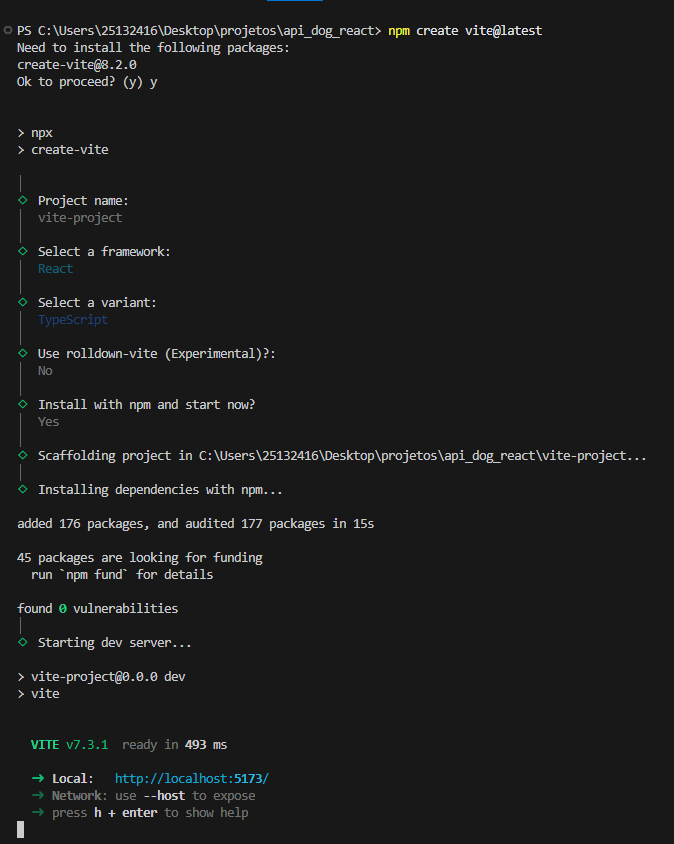

# API DOG UTILIZANDO O FRAMEWORK REACT

# React

O **React** é uma biblioteca JavaScript de código aberto, criada pelo Facebook, utilizada para construir **interfaces de usuário** de forma eficiente e escalável. Ele é baseado em componentes reutilizáveis, utiliza o Virtual DOM para otimizar atualizações na interface e segue um modelo declarativo, facilitando a manutenção e a previsibilidade do código.
O React é um dos frameworks mais populares por ser fácil de usar, altamente flexível e escalável, e é usado por muitas empresas de tecnologia, incluindo o Facebook, Instagram e Airbnb.  

  

# Por que utilizar React?

Motivos que tornam o React a escolha ideal para aplicações web dinâmicas, escaláveis e com alta interatividade.

---

## O Poder da Biblioteca

O React se destaca por transformar o desenvolvimento de interfaces complexas em um processo modular, previsível e altamente eficiente.

| Diferencial | Benefício Técnico | Valor para o Projeto |
| :--- | :--- | :--- |
| **Componentização** | Reutilização de código | Manutenção simplificada e rápida |
| **Virtual DOM** | Atualizações otimizadas | Performance fluida em UIs dinâmicas |
| **Ecossistema** | Vasta biblioteca de suporte | Menor tempo de desenvolvimento (Time-to-Market) |
| **Comunidade** | Documentação e suporte massivo | Facilidade de contratação e resolução de bugs |

---

## Motivos Estratégicos para a Escolha

### Arquitetura Baseada em Componentes
O React permite dividir a interface em peças independentes e reutilizáveis (como blocos de LEGO).
* **Vantagem:** Você escreve o código uma vez (ex: um botão de upload ou um card de produto) e o utiliza em todo o projeto.
* **Impacto:** Redução drástica na duplicação de código e facilidade para criar **Design Systems**.

### Programação Declarativa e Estado
Diferente do JS Vanilla, onde você precisa dizer ao navegador *como* mudar cada elemento, no React você apenas diz *como a interface deve ser* em um determinado estado.
> **Ponto Chave:** O React cuida de atualizar a tela automaticamente quando os dados mudam, o que evita bugs de sincronização entre o que o usuário vê e os dados do sistema.

### Ecossistema e Maturidade
Ao escolher React, você ganha acesso a milhares de soluções prontas:
* **UI Libraries:** Material UI, Tailwind, Shadcn/ui.
* **Gerenciamento de Dados:** TanStack Query, Redux Toolkit, Zustand.
* **Frameworks Full-stack:** Next.js (que resolve problemas de SEO e performance).

### Flexibilidade e Cross-platform
O conhecimento adquirido em React Web é quase totalmente transferível para o **React Native**.
* **Resultado:** Uma equipe de desenvolvedores web consegue criar aplicativos para iOS e Android sem precisar aprender Swift ou Kotlin do zero.

### Performance em UIs Complexas
Para aplicações onde os dados mudam constantemente (Dashboards, Redes Sociais, Editores Online), o **Virtual DOM** do React garante que apenas a parte necessária da tela seja redesenhada.
* **Benefício:** Evita gargalos de renderização que ocorreriam ao tentar manipular manualmente centenas de elementos do DOM real.

---

## Cenários Ideais
* **Single Page Application (SPA):** Experiência de uso fluida como um aplicativo instalado.
* **Plataformas de SaaS e Dashboards:** Onde a gestão de estado é complexa.
* **Projetos de Longo Prazo:** Onde a estabilidade e a facilidade de encontrar desenvolvedores são cruciais.

---

> **Conclusão:** O React se destaca quando a complexidade da interface justifica sua estrutura. É o investimento certo para projetos que visam escala, colaboração em equipe e interatividade rica.

# Quando NÃO utilizar React

Cenários onde a utilização do React pode ser uma escolha ruim, focando em performance, complexidade e produtividade.

---

O React é uma ferramenta poderosa, mas seu uso em contextos inadequados introduz um **custo de inicialização (bundle size)** e uma **complexidade desnecessária**.

| Cenário | Motivo Principal | Melhor Alternativa |
| :--- | :--- | :--- |
| **Landing Pages** | Peso do bundle desnecessário | HTML/CSS Puro |
| **Projetos Pequenos** | Muita configuração | JS Vanilla |
| **Dispositivos Limitados** | Alto consumo de memória | Vanilla JS |
| **Projetos de Larga Escala** | Fragmentação de bibliotecas | Angular |

---

## Detalhamento dos Cenários

### Sites Estáticos e Landing Pages
Para páginas focadas em conteúdo ou conversão simples, o React adiciona uma camada de processamento que não traz benefícios reais.
* **Impacto:** Aumenta o peso da página (bundle size), o que pode prejudicar o SEO e o tempo de carregamento inicial.
* **Recomendação:** Uso de HTML/CSS/JS puro.

### Projetos Pequenos e Simples
A necessidade de configurar ferramentas de compilação (*build tools*) tornam o React exagerado quando a interatividade não é o foco da aplicação.
> **Nota:** Se a interatividade for mínima, o custo de manutenção da estrutura do React supera sua utilidade.

### Aplicações de Performance Extrema (Mobile Web)
Em dispositivos móveis antigos ou com baixa capacidade de processamento, a execução do Virtual DOM e o parsing do JavaScript podem gerar latência perceptível.
* **Problema:** Alto consumo de memória RAM.
* **Sintoma:** Atraso (lag) na resposta aos inputs do usuário.

### Necessidade de um "Framework" Completo
O React é, tecnicamente, uma **biblioteca de interface (View)**. Ele não oferece soluções nativas para roteamento ou gerenciamento de estado global.
* **O Risco:** Isso exige a integração de múltiplas bibliotecas de terceiros, o que pode causar desorganização e falta de padronização em projetos de grande escala.

### Curva de Aprendizado Inicial
Para equipes habituadas ao desenvolvimento web tradicional, a transição para o paradigma funcional e de componentes do React pode atrasar a entrega.
* **Comparativo:** Opções como **Vue.js** costumam ser mais intuitivas para uma adoção imediata e produtividade rápida.

---

> **Conclusão:** A escolha da tecnologia deve ser guiada pelas necessidades do usuário final e pela infraestrutura disponível, e não apenas pela popularidade da ferramenta.

# Instalação e Configuração

### Requisitos do ambiente
Antes de criar um projeto React, é necessário ter alguns softwares instalados no computador.

### Node.js
O React utiliza o Node.js para gerenciar dependências e executar scripts.
Versão recomendada: Node.js 18 ou superior
Ao instalar o Node.js, o npm (Node Package Manager) é instalado automaticamente.
Para verificar se está instalado corretamente, execute no terminal:
    node -v
    npm -v
Se ambos retornarem versões, a instalação está correta.

### Editor de Código
Um editor de código facilita o desenvolvimento. O mais utilizado é:
Visual Studio Code (VS Code)
Extensões recomendadas:
- ES7 + React/Redux Snippets (Ela fornece atalhos (snippets) que geram automaticamente estruturas comuns de código React, como componentes, imports e hooks.)
- Prettier (Formatador automático de código)
- ESLint (Ferramenta de análise de código)

### Navegador Web
Qualquer navegador moderno funciona, como:
- Google Chrome
- Firefox
- Microsoft Edge

### Criação de um Projeto React 
Atualmente, a forma mais recomendada de iniciar um projeto React é utilizando o Vite, que é rápido e simples.

### Criando o Projeto com Vite 
No terminal, navegue até a pasta onde deseja criar o projeto e execute:
npm create vite@latest

Durante o processo:
1. Escolha um nome para o projeto
2. Selecione React como framework
3. Escolha JavaScript ou TypeScript
4. Escolha se vai utilizar o rolldown-vite (Experimental)
5. Instale o npm
6. O servidor inicia com sucesso

# Utilização de REACT em um projeto na prática

### Tela inicial

### Resultado da busca

## Tecnologias Utilizadas

Este projeto foi construído para demonstrar o uso de React com tipagem estática e ferramentas de build de alta performance.

| Tecnologia | Função |
| :--- | :--- |
| **React** | Biblioteca principal de UI |
| **TypeScript** | Segurança de tipos |
| **Vite** | Ferramenta de build e desenvolvimento rápido |
| **CSS3** | Layout responsivo com Flexbox e Grid |
| **Dog API** | Fonte de dados e imagens |

---

## Funcionalidades

* **Busca por Raça:** Encontre fotos específicas de qualquer raça disponível na API.
* **Interface Fluida:** Transição entre a tela de busca e a grade de resultados.
* **Design Responsivo:** Adaptado para dispositivos móveis e desktops.
* **Tratamento de Erros:** Feedback visual caso a raça não seja encontrada.  

## Autores
[Marcelo Vieira](<https://www.linkedin.com/in/marcelovieirasilva/>)  
[Nicolas dos Santos](<https://www.linkedin.com/in/nicolas-durao//>)  
[Pedro Henrique](<https://github.com/ghpedro16/>)  

